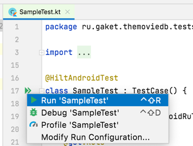
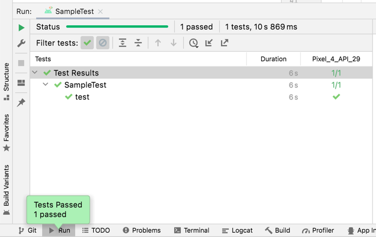
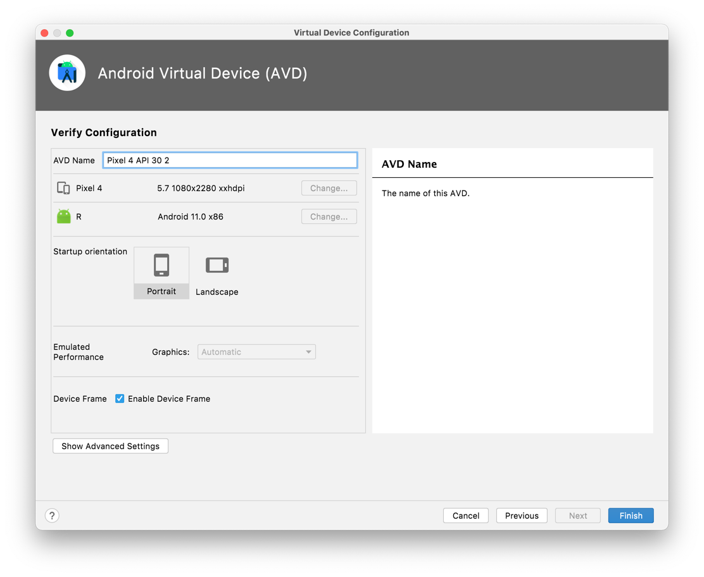

# Workshop
This is the branch for the workship after the Linters part of the lecture.

## Agenda
This workshop consists of the three main parts:
1. Lint configuration;
2. Writing custom Lint rule;
3. Testing custom Lint rule.

## Part 1: Lint configuration
Lint is already there in the project as part of AGP. While discovering the project you could notice that there're some Lint rule violations already exist. We're going to enforce the policy, which prevent the number of violations from growing and also try handle some existing issues. Lets start.

- Build the application by executing the `./gradlew :app:build` command in the terminal. Observe that build is successful;
- Observe that Lint reports are produced. That's because `build` task depends on `lint` task by default:
  
- Run the Lint via `./gradlew :app:lint` command in the terminal. You should see the same report:
  
- Open the `lint-results.xml` file and investigate the issues found. There must be 17 issues;
- The build succeeds because all those issues has `warning` severity. However, for the best product quality those should be addressed;
- First of all, lets prevent the number of issues from growing. Open `app/build.gradle` file and create `lintOptions` section inside of the `android` section:
  
- Set `warningsAsErrors` property within it to `true`:
  
- Build the application by executing the `./gradlew :app:build` command in the terminal. Observe that build fails:
  
- Now lets make the build pass again;
- Lets fix the `UnusedResources`issue. There must be 5 occurrences of it in the report. Just delete the referenced resources:
  
- Fix the `IconLocation` issue. Issue description suggests moving the referenced image into `drawable-nodpi` folder. Do it:
  
  
- Fix the `Autofill` issue. We don't need auto fill, so fix it by one of the ways the rule suggests:
  
- Run the build again. Observe that report has become smaller by 7 issues:
  
- Lets imagine that we can't fix the `VectorPath` issue as nobody can provide us new resource. It means that we should suppress it;
- Open the referenced file and add `tools` namespace into it. Just start typing "tools" and you should see the quick suggestion from the Android Studio:
  
- Add `tools:ignore="VectorPath"` attribute into the root tag of the image:
  
- `Overdraw` issue might be hard to fix as it might require changing the design system. Also, in some cases the reporting of this issue is false-positive. Anyway, we don't want to **ever** fix it. Lets disable this rule;
- Open `app/build.gradle` file and navigate to the `lintOptions` section. Add there `disable 'Overdraw'` property:
  
- Run the build again. Only 7 issues blocking the successful build!
  
- There're accessibility related and backup related issues left. We can't do it right now, because we don't have necessary string resources and don't know how our product should handle backup. But we definitely want them to be addressed **in the future** and we also want new code to not violate those rules. It means that we **must not** suppress those issues or disable the related rule. We should put them into the `lint-baseline.xml` file and fix later;
- Open `app/build.gradle` file and navigate to the `lintOptions` section. Add there `baseline file("lint-baseline.xml")` property:
  
- Run the build again. Observe it fails. Read the failure reason carefully:
  
- Observe `lint-baseline.xml` file created in the `app` module. Check that it has the content similar to the `lint-result.xml`:
  
- Run the build again. Observe it passes:
  
- Commit all changes including the `lint-baseline.xml` into the repository.

## Part 2: Custom Lint rules
In our project all dimensions are set through the dimen resources. All except of the text sizes. We'll create a lint rule to warn developers about the hardcoded text size usage.
- Create new Kotlin module using "new module" wizard in Android Studio. Call module `lint-ruleset`, package `com.example.ruleset` and main class `HardcodedTextSizeUsageDetector`:
  
  
- Go to the `build.gradle` file of the new module and leave there only Kotlin plugin addition:
  
- In the same file add the dependency to the lint api. Notice, that the version must be equal to the AGP version +23:
  
- Open `HardcodedTextSizeUsageDetector` file. Make the class extend `LayoutDetector`:
  
- Create and configure issue. You can setup all fields as you wish except of the `implementation`:
  
- Make the detector visit `textSize` attributes of the view. To do that, override the `getApplicableElements` method:
  
- Implement attribute visitor by overriding `visitAttribute` method. We don't need to process `textSize` attributes not from `android` namespace and we want to report the issue whenever the value of an attribute does not reference any resource:
  
- It's time to create `IssueRegistry`. Create the class caleld `ExampleIssueRegistry`, inherit it from the `IssueRegistry` class and override properties `api` and `issues`. It is important to override `api` property, otherwise you'll get `ObsoleteLintCustomCheck` warning reported by the Lint:
  
- Add your service registry into the Java service locator. Open `lint-rules/build.gradle` file and add there the following lines:
  
- Add the custom checks to your project. Open `app/build.gradle` and add there one more dependency:
  
- Run the build. Observe it failing due to the violations of our custom rule:
  
- Open one of the files, which violates the rule and observe issue highlighting in editor:
  

## Part 3: Testing custom Lint rules
In this part we're going to test the rule, which we've just written.

>> If test written in this part fails due to the "absent SDK" please setup ANDROID_HOME environment variable and point it to the Android SDK root folder.

- Configure Lint test dependencies:
  
- We'll use JUnit5 (Jupiter Platform) as a testing framework. Add the necessary dependencies and enable the `junitPlatform`:
  
  
- You can try using JUnit4 on your own;
- We'll test the scenario when resource value is used and thus no rule violation reported. Create a test file a test in it. Given it meaningful name!
  
- Prepare test data. In our case it'll be an XML file. Use `TestFiles#xml` helper function to create it:
  
- Now, lets configure a `TestLintTask`. Create it using `TestLintTask#lint` function, feed it the xml file, which you've just created. Then pass in the `HardcodedTextSizeUsageIssue` - it is good practice to test a single rule per test:
  
- Now run the task and expect it to be clean. Execute the test and check that it works:
  
- Cover the "rule violation" scenario by yourself.